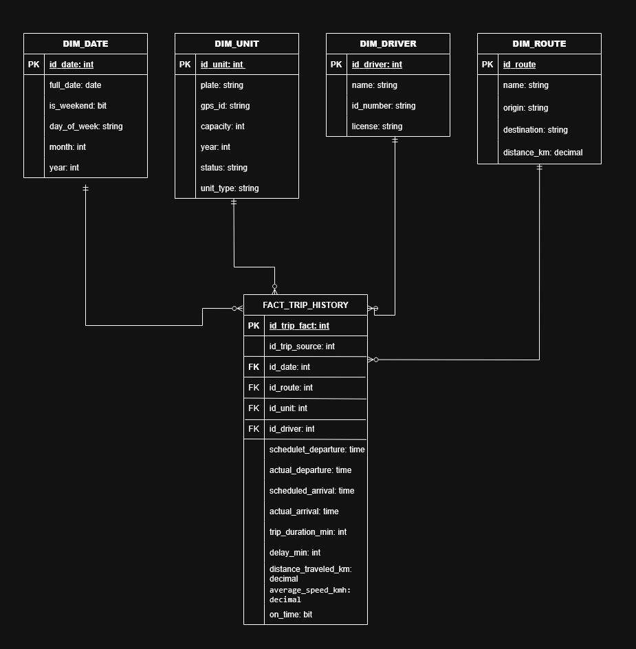

# Documentación de Diseño de Base de Datos — SQL Server (Data Warehouse)

**Proyecto:** Transporte Público Inteligente /
**Motor:** SQL Server

---

## Justificación del motor SQL-Server

A esta parte del proyecto le toca resolver algo diferente a lo que se realiza o se encarga PostgreSQL y MongoDB. Mientras que en Mongo y Postgre se encargan del día a día en registrar las diferentes rutas, choferes, horarios, capturar la posición GPS de cada unidad en tiempo real, etc.
SQL Server se encarga de realizar otro rol, es donde termina viviendo toda esa información ya digerida, lista para que alguien pueda preguntar cosas como "qué ruta se atrasa más?" o "qué unidad cumple menos el horario?" sin la necesidad de tener que hacer cálculos pesados para lograr responder esas preguntas.

Por eso el modelo no está armado como una base transaccional normal, con muchas tablas pequeñas relacionadas entre sí. Se usa lo que se conoce como **esquema estrella**: una tabla central que guarda cada viaje que ocurrió, junto con sus números, ejemplo: si llegó tarde, cuánto recorrió, a qué velocidad iba. Alrededor unas tablas más pequeñas que solo dan contexto como la fecha, la ruta, la unidad, el chofer, etc. 
La idea principal de esto es que al consultar y agrupar esta información sea más rápido y fácil, aunque eso signifique repetir algunos datos que ya existen en Postgre o Mongo.

---

## Cómo está armado el modelo?

()

En el centro está `FACT_TRIP_HISTORY`, que sería practicamente la "bitácora" de todos los viajes que ya fueron completados. Cada fila ahí va a representar de cierto modo un viaje: obteniendo datos, tales como: quién lo hizo, en qué ruta, qué tan puntual fue, cuánto recorrió y a qué velocidad.

Alrededor de esa tabla están las cuatro dimensiones que le dan sentido a esos números: `DIM_DATE` es para saber cuándo, luego está `DIM_ROUTE` para saber en qué ruta, `DIM_UNIT` qué unidad y `DIM_DRIVER` con qué chofer. Cada una es practicamente una versión más simple de lo que ya existe en PostgreSQL, esto no se llenan a mano ni se editan directamente en SQL, sino que se actualizan solas cada vez que corre el proceso de integración. Si algo llega a cambiar, dicho cambio se hace directamente en PostgreSQL y desde ahí se refleja en SQL.

La relación entre cada dimensión y la tabla central siempre es la misma: una ruta puede aparecer en muchos viajes, una unidad puede tener muchos viajes en su historial, un chofer puede haber conducido muchos viajes, pero cada viaje individual solo pertenece a una ruta, una unidad, un chofer y una fecha específica.

---

## Algunas decisiones que vale la pena explicar

Hay un campo que guarda el identificador del viaje tal como existe en PostgreSQL, esto es para poder rastrear de dónde vino cada registro histórico, en caso de que alguien necesite ir a revisar el dato original.

También se agregó el identificador del GPS de cada unidad como parte de su dimensión. La razón es simple: es lo que realmente conecta esta base con los eventos que llegan desde Mongo. La placa de un bus podría coincidir siempre con el mismo vehículo, pero el GPS instalado en él es lo que realmente identifica de dónde vienen los datos de posición.

Otra cosa importante: ni el atraso, ni la distancia recorrida, ni la velocidad promedio se calculan aquí en el momento de hacer una consulta. Todo eso ya llega calculado desde el proceso de integración. Esto es intencional, así cuando alguien pide un reporte, la respuesta es casi inmediata, en lugar de tener que procesar miles de puntos GPS cada vez que alguien quiere ver un número.

---

## De dónde vienen realmente los datos

Nada de lo que hay en esta base de datos se escribe directamente aquí. Todo pasa primero por un proceso de integración (ETL), que hace tres cosas:

Primero tomar la información de PostgreSQL como las rutas, choferes, unidades, horarios, viajes y los eventos GPS de MongoDB. Luego cruza esos datos para calcular si un viaje llegó tarde y qué tanto recorrió la unidad. Finalmente deja ese resultado ya listo en esta base, actualizando también las dimensiones si aparece algo nuevo, como una unidad que no existía antes o un chofer recien contratado.

Gracias a este diseño, todo el análisis histórico se puede consultar directamente aquí, sin necesidad de tocar las otras dos bases y sin afectar su rendimiento.

---

## Disponibilidad y respaldo

Para que esta base no se caiga fácilmente, se propone tenerla replicada en varios nodos usando Always On de SQL Server: uno principal que recibe los datos, uno que se mantiene sincronizado en tiempo real por si el principal falla, y uno adicional pensado solo para que los analistas consulten sin afectar las cargas que hace el proceso ETL.