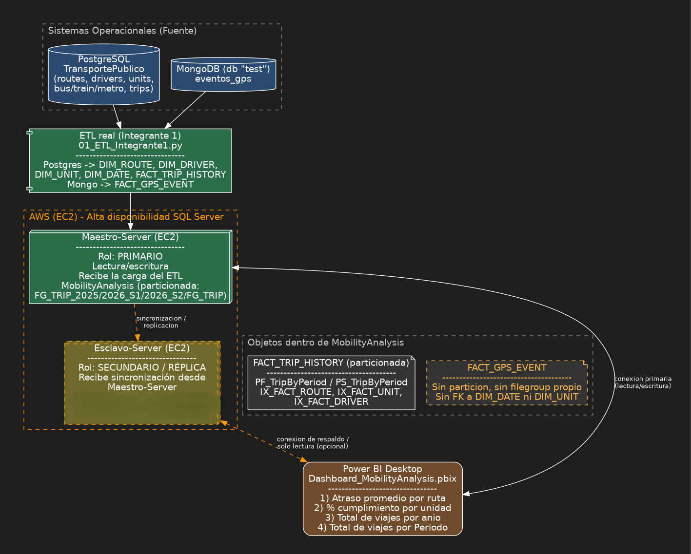
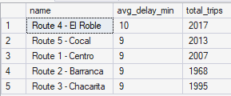
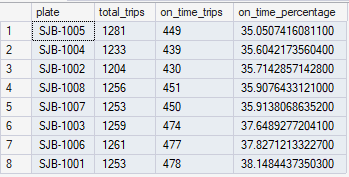
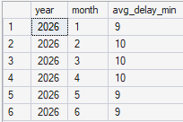
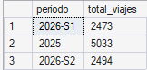
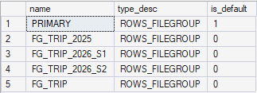
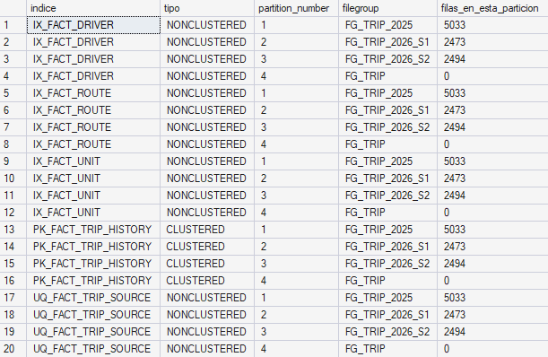
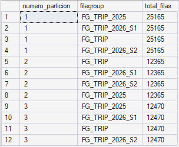

# Documentación Entregable 2 — (SQL Server, rendimiento y alta disponibilidad)

**Proyecto:** Transporte Público Inteligente
**Indicaciones:** Leer Avance proyecto - Semana 2.pdf

---

## 1. Arquitectura física actual



---

## 2. Pruebas de rendimiento

### Consultas de rendimiento — fase "ANTES" (sin filegroups, sin partición)

Se corrieron las 4 consultas analíticas de `SQL-Server/01_performance_testing.sql` contra `MobilityAnalysis` en su estado actual: sin filegroups adicionales, sin partición, con los índices originales y los 10,000 registros sintéticos de `04_datos_prueba.sql`.

**Prueba 1 — Atraso promedio por ruta**



```txt
SQL Server parse and compile time: 
   CPU time = 5 ms, elapsed time = 7 ms.

(5 rows affected)
Table 'Worktable'. Scan count 0, logical reads 0, physical reads 0, page server reads 0, read-ahead reads 0, page server read-ahead reads 0, lob logical reads 0, lob physical reads 0, lob page server reads 0, lob read-ahead reads 0, lob page server read-ahead reads 0.
Table 'DIM_ROUTE'. Scan count 0, logical reads 10, physical reads 0, page server reads 0, read-ahead reads 0, page server read-ahead reads 0, lob logical reads 0, lob physical reads 0, lob page server reads 0, lob read-ahead reads 0, lob page server read-ahead reads 0.
Table 'Workfile'. Scan count 0, logical reads 0, physical reads 0, page server reads 0, read-ahead reads 0, page server read-ahead reads 0, lob logical reads 0, lob physical reads 0, lob page server reads 0, lob read-ahead reads 0, lob page server read-ahead reads 0.
Table 'FACT_TRIP_HISTORY'. Scan count 1, logical reads 98, physical reads 0, page server reads 0, read-ahead reads 0, page server read-ahead reads 0, lob logical reads 0, lob physical reads 0, lob page server reads 0, lob read-ahead reads 0, lob page server read-ahead reads 0.

 SQL Server Execution Times:
   CPU time = 3 ms,  elapsed time = 2 ms.

Completion time: 2026-08-19T18:05:14.9030398-06:00
```

**Prueba 2 — % de cumplimiento por unidad**



```txt
SQL Server parse and compile time: 
   CPU time = 4 ms, elapsed time = 4 ms.

 SQL Server Execution Times:
   CPU time = 0 ms,  elapsed time = 0 ms.

 SQL Server Execution Times:
   CPU time = 0 ms,  elapsed time = 0 ms.

(8 rows affected)
Table 'Worktable'. Scan count 0, logical reads 0, physical reads 0, page server reads 0, read-ahead reads 0, page server read-ahead reads 0, lob logical reads 0, lob physical reads 0, lob page server reads 0, lob read-ahead reads 0, lob page server read-ahead reads 0.
Table 'DIM_UNIT'. Scan count 0, logical reads 16, physical reads 0, page server reads 0, read-ahead reads 0, page server read-ahead reads 0, lob logical reads 0, lob physical reads 0, lob page server reads 0, lob read-ahead reads 0, lob page server read-ahead reads 0.
Table 'Workfile'. Scan count 0, logical reads 0, physical reads 0, page server reads 0, read-ahead reads 0, page server read-ahead reads 0, lob logical reads 0, lob physical reads 0, lob page server reads 0, lob read-ahead reads 0, lob page server read-ahead reads 0.
Table 'FACT_TRIP_HISTORY'. Scan count 1, logical reads 98, physical reads 0, page server reads 0, read-ahead reads 0, page server read-ahead reads 0, lob logical reads 0, lob physical reads 0, lob page server reads 0, lob read-ahead reads 0, lob page server read-ahead reads 0.

 SQL Server Execution Times:
   CPU time = 3 ms,  elapsed time = 2 ms.

Completion time: 2026-08-19T18:06:24.9855795-06:00
```

**Prueba 3 — Atraso promedio filtrado por rango de fechas (2026-S1)**



```txt
(6 rows affected)
Table 'Worktable'. Scan count 0, logical reads 0, physical reads 0, page server reads 0, read-ahead reads 0, page server read-ahead reads 0, lob logical reads 0, lob physical reads 0, lob page server reads 0, lob read-ahead reads 0, lob page server read-ahead reads 0.
Table 'DIM_DATE'. Scan count 1, logical reads 3, physical reads 0, page server reads 0, read-ahead reads 0, page server read-ahead reads 0, lob logical reads 0, lob physical reads 0, lob page server reads 0, lob read-ahead reads 0, lob page server read-ahead reads 0.
Table 'Workfile'. Scan count 0, logical reads 0, physical reads 0, page server reads 0, read-ahead reads 0, page server read-ahead reads 0, lob logical reads 0, lob physical reads 0, lob page server reads 0, lob read-ahead reads 0, lob page server read-ahead reads 0.
Table 'FACT_TRIP_HISTORY'. Scan count 1, logical reads 98, physical reads 0, page server reads 0, read-ahead reads 0, page server read-ahead reads 0, lob logical reads 0, lob physical reads 0, lob page server reads 0, lob read-ahead reads 0, lob page server read-ahead reads 0.

 SQL Server Execution Times:
   CPU time = 3 ms,  elapsed time = 2 ms.

Completion time: 2026-08-19T18:07:12.9323636-06:00
```

**Prueba 4 — Total de viajes por periodo**


```txt
SQL Server parse and compile time: 
   CPU time = 2 ms, elapsed time = 2 ms.

(3 rows affected)
Table 'Worktable'. Scan count 0, logical reads 0, physical reads 0, page server reads 0, read-ahead reads 0, page server read-ahead reads 0, lob logical reads 0, lob physical reads 0, lob page server reads 0, lob read-ahead reads 0, lob page server read-ahead reads 0.
Table 'Workfile'. Scan count 0, logical reads 0, physical reads 0, page server reads 0, read-ahead reads 0, page server read-ahead reads 0, lob logical reads 0, lob physical reads 0, lob page server reads 0, lob read-ahead reads 0, lob page server read-ahead reads 0.
Table 'FACT_TRIP_HISTORY'. Scan count 1, logical reads 98, physical reads 0, page server reads 0, read-ahead reads 0, page server read-ahead reads 0, lob logical reads 0, lob physical reads 0, lob page server reads 0, lob read-ahead reads 0, lob page server read-ahead reads 0.

 SQL Server Execution Times:
   CPU time = 3 ms,  elapsed time = 3 ms.
SQL Server parse and compile time: 
   CPU time = 0 ms, elapsed time = 0 ms.

Completion time: 2026-08-19T17:54:55.7187142-06:00
```

### Conclusión

Las pruebas realizadas en la fase **“ANTES”**, sin la implementación de filegroups ni particionamiento, permitieron establecer una línea base del comportamiento de la base de datos. Las cuatro consultas presentaron tiempos de ejecución bajos, entre **2 y 3 ms**, y no registraron lecturas físicas, lo que indica que los datos utilizados se encontraban disponibles en memoria durante las pruebas. Sin embargo, las consultas sobre `FACT_TRIP_HISTORY` realizaron **98 lecturas lógicas**, evidenciando el acceso a los datos necesarios para generar los resultados. Estos valores servirán como referencia para comparar posteriormente el comportamiento de la base de datos después de aplicar las optimizaciones.

**Creacion de los FileGroups**




**Creacion de los Indices**



**Tabla Particionada**



### Consultas de rendimiento — fase "Despues" (con filegroups, con partición)

Se corrieron las 4 consultas analíticas de `SQL-Server/01_performance_testing.sql` contra `MobilityAnalysis`: con filegroups, con partición.

**Prueba 1 — Atraso promedio por ruta**


```txt
(5 rows affected)
Table 'Worktable'. Scan count 0, logical reads 0, physical reads 0, page server reads 0, read-ahead reads 0, page server read-ahead reads 0, lob logical reads 0, lob physical reads 0, lob page server reads 0, lob read-ahead reads 0, lob page server read-ahead reads 0.
Table 'DIM_ROUTE'. Scan count 0, logical reads 10, physical reads 1, page server reads 0, read-ahead reads 0, page server read-ahead reads 0, lob logical reads 0, lob physical reads 0, lob page server reads 0, lob read-ahead reads 0, lob page server read-ahead reads 0.
Table 'Workfile'. Scan count 0, logical reads 0, physical reads 0, page server reads 0, read-ahead reads 0, page server read-ahead reads 0, lob logical reads 0, lob physical reads 0, lob page server reads 0, lob read-ahead reads 0, lob page server read-ahead reads 0.
Table 'FACT_TRIP_HISTORY'. Scan count 4, logical reads 40, physical reads 0, page server reads 0, read-ahead reads 0, page server read-ahead reads 0, lob logical reads 0, lob physical reads 0, lob page server reads 0, lob read-ahead reads 0, lob page server read-ahead reads 0.

 SQL Server Execution Times:
   CPU time = 3 ms,  elapsed time = 4 ms.

Completion time: 2026-08-19T18:24:49.0612656-06:00
```

**Prueba 2 — % de cumplimiento por unidad**


```txt
(8 rows affected)
Table 'Worktable'. Scan count 0, logical reads 0, physical reads 0, page server reads 0, read-ahead reads 0, page server read-ahead reads 0, lob logical reads 0, lob physical reads 0, lob page server reads 0, lob read-ahead reads 0, lob page server read-ahead reads 0.
Table 'DIM_UNIT'. Scan count 0, logical reads 16, physical reads 0, page server reads 0, read-ahead reads 0, page server read-ahead reads 0, lob logical reads 0, lob physical reads 0, lob page server reads 0, lob read-ahead reads 0, lob page server read-ahead reads 0.
Table 'Workfile'. Scan count 0, logical reads 0, physical reads 0, page server reads 0, read-ahead reads 0, page server read-ahead reads 0, lob logical reads 0, lob physical reads 0, lob page server reads 0, lob read-ahead reads 0, lob page server read-ahead reads 0.
Table 'FACT_TRIP_HISTORY'. Scan count 4, logical reads 37, physical reads 0, page server reads 0, read-ahead reads 0, page server read-ahead reads 0, lob logical reads 0, lob physical reads 0, lob page server reads 0, lob read-ahead reads 0, lob page server read-ahead reads 0.

 SQL Server Execution Times:
   CPU time = 3 ms,  elapsed time = 2 ms.

Completion time: 2026-08-19T18:24:15.6013523-06:00

```

**Prueba 3 — Atraso promedio filtrado por rango de fechas (2026-S1)**


```txt
(6 rows affected)
Table 'Worktable'. Scan count 0, logical reads 0, physical reads 0, page server reads 0, read-ahead reads 0, page server read-ahead reads 0, lob logical reads 0, lob physical reads 0, lob page server reads 0, lob read-ahead reads 0, lob page server read-ahead reads 0.
Table 'DIM_DATE'. Scan count 1, logical reads 3, physical reads 1, page server reads 0, read-ahead reads 0, page server read-ahead reads 0, lob logical reads 0, lob physical reads 0, lob page server reads 0, lob read-ahead reads 0, lob page server read-ahead reads 0.
Table 'Workfile'. Scan count 0, logical reads 0, physical reads 0, page server reads 0, read-ahead reads 0, page server read-ahead reads 0, lob logical reads 0, lob physical reads 0, lob page server reads 0, lob read-ahead reads 0, lob page server read-ahead reads 0.
Table 'FACT_TRIP_HISTORY'. Scan count 1, logical reads 10, physical reads 0, page server reads 0, read-ahead reads 0, page server read-ahead reads 0, lob logical reads 0, lob physical reads 0, lob page server reads 0, lob read-ahead reads 0, lob page server read-ahead reads 0.

 SQL Server Execution Times:
   CPU time = 3 ms,  elapsed time = 3 ms.

Completion time: 2026-08-19T18:25:19.3558162-06:00
```

**Prueba 4 — Total de viajes por periodo**


```txt
(3 rows affected)
Table 'Worktable'. Scan count 0, logical reads 0, physical reads 0, page server reads 0, read-ahead reads 0, page server read-ahead reads 0, lob logical reads 0, lob physical reads 0, lob page server reads 0, lob read-ahead reads 0, lob page server read-ahead reads 0.
Table 'Workfile'. Scan count 0, logical reads 0, physical reads 0, page server reads 0, read-ahead reads 0, page server read-ahead reads 0, lob logical reads 0, lob physical reads 0, lob page server reads 0, lob read-ahead reads 0, lob page server read-ahead reads 0.
Table 'FACT_TRIP_HISTORY'. Scan count 4, logical reads 34, physical reads 0, page server reads 0, read-ahead reads 0, page server read-ahead reads 0, lob logical reads 0, lob physical reads 0, lob page server reads 0, lob read-ahead reads 0, lob page server read-ahead reads 0.

 SQL Server Execution Times:
   CPU time = 3 ms,  elapsed time = 3 ms.

Completion time: 2026-08-19T18:25:47.6856406-06:00
```
### Comparación "ANTES" vs "DESPUÉS"

| Consulta | Scan count (antes → después) | Logical reads (antes → después) | Reducción |
|---|---|---|---|
| 1. Atraso promedio por ruta | 1 → 4 | 98 → 40 | -59% |
| 2. % cumplimiento por unidad | 1 → 4 | 98 → 37 | -62% |
| 3. Atraso, rango 2026-S1 | 1 → 1 | 98 → 10 | -90% |
| 4. Total viajes por periodo | 1 → 4 | 98 → 34 | -65% |

### Conclusión

Tras aplicar filegroups, la función y esquema de partición, y los nuevos índices alineados a la partición, las cuatro consultas mostraron una reducción clara en las lecturas lógicas sobre `FACT_TRIP_HISTORY`, con caídas de entre el 59% y el 90% respecto a la línea base. El caso más representativo es la **Prueba 3** (filtro por rango de fechas `2026-S1`): mientras que en las pruebas 1, 2 y 4 el *scan count* subió de 1 a 4 —porque SQL Server debe recorrer las cuatro particiones al no filtrar por fecha—, en la Prueba 3 el *scan count* se mantuvo en 1, evidenciando **partition elimination**: el motor identificó que el rango solicitado cae completo dentro de la partición `FG_TRIP_2026_S1` y omitió por completo las otras tres. Esto explica que sea la consulta con la mayor reducción de lecturas lógicas (98 → 10, -90%), y confirma que el particionamiento está funcionando exactamente como se diseñó para las consultas filtradas por fecha, que son el patrón de acceso más común en los reportes históricos del dashboard.

En cuanto a tiempos de CPU y de ejecución, la diferencia entre "antes" y "después" es mínima (2-4 ms en ambos casos), lo cual es esperable con un volumen de prueba de 10,000 filas: el conjunto de datos completo cabe en memoria (`physical reads` en 0 casi en su totalidad), por lo que el reloj no alcanza a reflejar la mejora. La métrica que sí es sensible a esta escala es la de lecturas lógicas, que es consistente y medible en las cuatro pruebas. Se espera que, con el volumen real de datos que cargue el proceso ETL desde PostgreSQL, la mejora se refleje también en tiempos de ejecución, no solo en I/O lógico.

---

## 3. Alta Disponiblidad

`[PENDIENTE]`

---